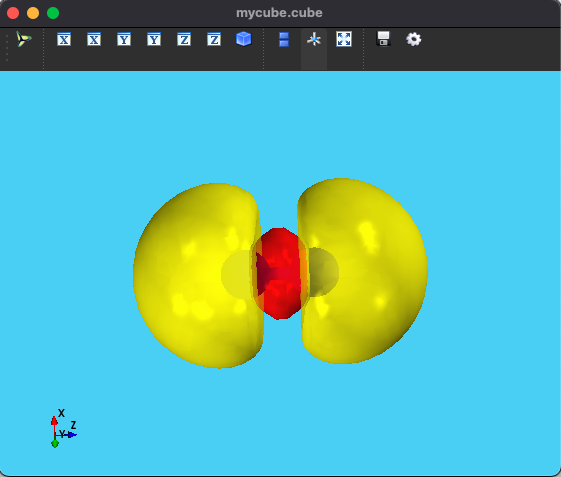
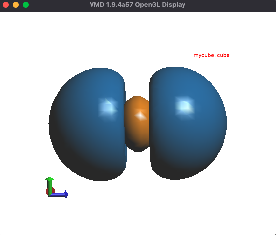

# Cube-Visualizer

Python scripts for rendering Qchem cube files from the command line.

# Resources:

I found a nice discussion about the Gaussian cube file format [here](http://sobereva.com/125). Check it out if you want to know how to read the grid data from a cube file.

Here are two scripts, one using Mayavi (`mcube.py`) and the other using VMD (`vmdcube.py`).
Mayavi is fairly simple to install according to its documentation however, it fails to build the wheel in my laptop. If you face the same issue, please follow this github [discussion](https://github.com/enthought/mayavi/issues/1232). I tested it in both Intel and Apple Silicon M2-max (os: Ventura) machines, and it works fine. One downside is that Mayavi is a bit slow, as it's a Python library on top of pyVTK.

Using VMD is quite fast. Install the VMD first. The only requirement is that `VMDPATH` needs to specified in the environment in order to use the vmd script. e.g., in mac

```shell
export VMDPATH="/Applications/VMD\ 1.9.4a57-x86_64-Rev12.app/Contents/Resources/VMD.app/Contents/MacOS/VMD"
```

# Usage

Export the scripts to the system path and `chmod +x <script>` and call them from the command line.

```shell
mcube.py cube_file_name isosurface_value(optional)
```

or

```shell
vmdcube.py cube_file_name isosurface_value(optional)
```

The default isosurface_value is set to 0.02. Set it accordingly.
You can open multiple cube files in a directory with a basic shell loop. e.g.

```shell
for i in $(find . -name "*.cube"); do echo $i; vmdcube.py $i &; sleep 2;  done
```

I added a 2s sleep otherwise, sometimes Mayavi/VMD crashed for a large number cube file.

Some exaple images:
Mayavi:


VMD:


`mcube.py` is not totally complete yet. You may have to tweak it for visualizing other molecules properly although it is quite easy :)) (Check the code). Use `vmdcube.py`. It's more complete and can render any molecule.

## Related projects:

- [vmd_cube](https://github.com/fevangelista/vmd_cube)
